# oni-flagship-mods

Gameplay mods for Oxygen Not Included built on the simulation SDK. They use only the public
`OniFramework` API, so they are also working examples of what a third-party mod can do with it.

| mod | folder | summary |
|---|---|---|
| Mod 1 — Physical Thermodynamics + Fluid Dynamics | [`mod1-thermo-fluid`](mod1-thermo-fluid/README.md) | heat that is moved instead of deleted, gas mixtures, pipe pressure, phase change with latent heat |
| Mod 2 — Matter / Environmental Physics | [`mod2-matter-environment`](mod2-matter-environment/README.md) | nitrogen and pollutant as real elements, with their physical properties |

This is one part of the SDK. The replacement simulation library is in
[oni-sim-replacement](https://github.com/Salacious-Oni-Dev/oni-sim-replacement), the API these mods call is in
[oni-framework-api](https://github.com/Salacious-Oni-Dev/oni-framework-api), and the guides that cover the SDK
as a whole are in [oni-sdk-docs](https://github.com/Salacious-Oni-Dev/oni-sdk-docs).

**Status: alpha.** Behaviour and balance can change between releases.

**Windows only.** The simulation library is a Windows DLL, so the SDK needs the game's Windows
version.

## Showcase videos

Short recordings of the mods running in test scenarios. Each preview loops a few seconds;
click one to download the full video from the release. The test scenarios are developer
tooling and are not part of this repository.

| preview | what it shows |
|---|---|
| [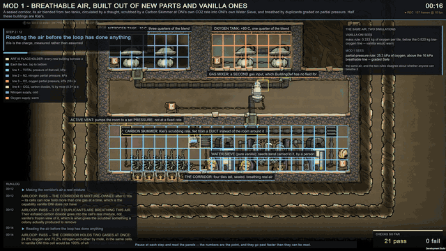](https://github.com/Salacious-Oni-Dev/oni-flagship-mods/releases/download/v0.1.0-alpha.1/airloop.mp4) | **Air loop**<br>A sealed corridor holding 75% nitrogen and 25% oxygen in the same cells, which vanilla ONI cannot do. A mixer blends the air, a vent supplies it and a Carbon Skimmer scrubs the CO2. Duplicants are graded on oxygen partial pressure, not kilograms. |
| [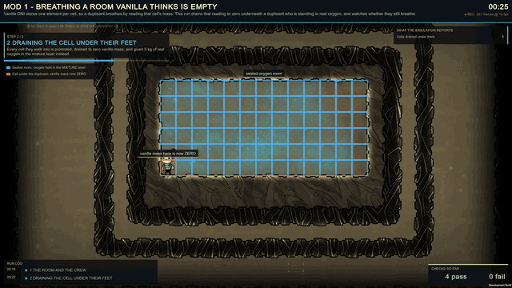](https://github.com/Salacious-Oni-Dev/oni-flagship-mods/releases/download/v0.1.0-alpha.1/breathtest.mp4) | **Breathing an 'empty' room**<br>Mod 1 keeps a room's air in a mixture layer and drains the vanilla per-cell reading to zero, which is what a suffocating duplicant looks like to unpatched code. This run builds that worst case on purpose: every cell the duplicant walks into is drained, and they keep breathing the real oxygen. |
| [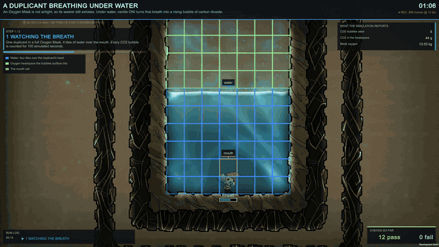](https://github.com/Salacious-Oni-Dev/oni-flagship-mods/releases/download/v0.1.0-alpha.1/bubblebreath.mp4) | **Breathing under water**<br>An Oxygen Mask is not airtight, so its wearer still breathes out. Under water each breath rises as a bubble of CO2. Every bubble is counted, along with the gas that dissolves into the water on the way up and the gas that reaches the air above. |
| [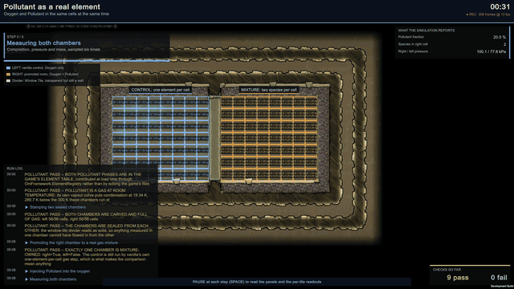](https://github.com/Salacious-Oni-Dev/oni-flagship-mods/releases/download/v0.1.0-alpha.1/pollutant.mp4) | **Pollutant as a real gas**<br>Vanilla ONI stores one element per cell, so Polluted Oxygen is its own substance. Here Oxygen and Pollutant share the same cells as a real two-gas mixture, both measurable and both adding to the pressure, next to a vanilla chamber as the control. Pollutant is registered through the framework's element API. |
| [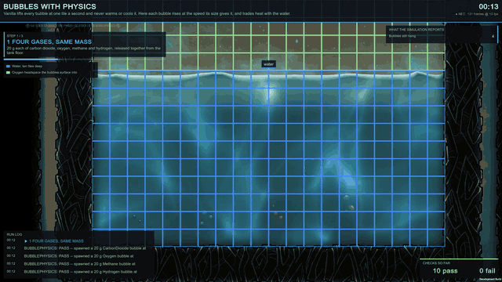](https://github.com/Salacious-Oni-Dev/oni-flagship-mods/releases/download/v0.1.0-alpha.1/bubblephysics.mp4) | **Bubble physics**<br>Vanilla lifts every bubble at one tile a second. Here 20 g each of CO2, oxygen, methane and hydrogen rise at the speed their size gives them, growing as the water pressure above them drops. Hot bubbles give their heat to the water they pass through. |
| [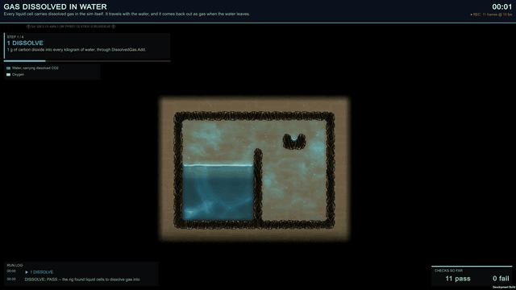](https://github.com/Salacious-Oni-Dev/oni-flagship-mods/releases/download/v0.1.0-alpha.1/dissolve.mp4) | **Dissolved gas in a flood**<br>Every liquid cell carries dissolved gas in the simulation itself. When the dam breaks, the gas travels with the flood. When water is taken out or boiled off, its share of the gas comes back out as bubbles. |
| [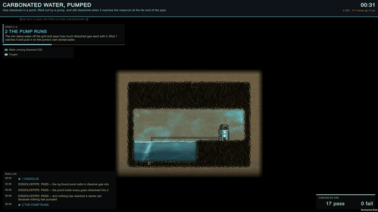](https://github.com/Salacious-Oni-Dev/oni-flagship-mods/releases/download/v0.1.0-alpha.1/dissolvedpipe.mp4) | **Carbonated water, pumped**<br>CO2 dissolved in a pond is pumped down a pipe and is still dissolved when it reaches the reservoir at the far end. Then a pipe is broken: the water spills into the world and its gas comes back out, because matter always goes somewhere. |
| [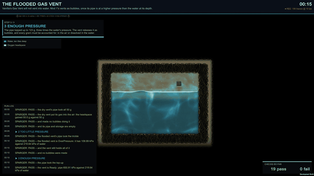](https://github.com/Salacious-Oni-Dev/oni-flagship-mods/releases/download/v0.1.0-alpha.1/sparger.mp4) | **The flooded gas vent**<br>Vanilla's Gas Vent will not vent into water. Mod 1's holds its gas while the pipe pressure is below the water's pressure at its depth, then releases it as bubbles once it is higher. Every gram ends up in the air or dissolved in the water. |
| [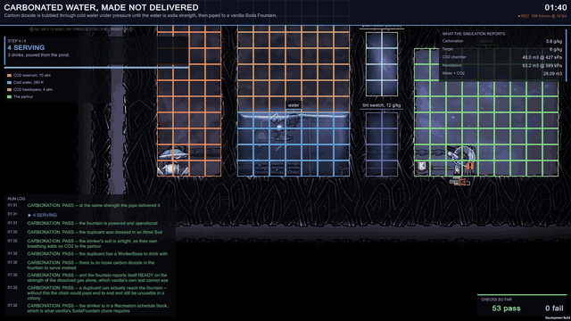](https://github.com/Salacious-Oni-Dev/oni-flagship-mods/releases/download/v0.1.0-alpha.1/carbonation.mp4) | **Carbonation**<br>CO2 is bubbled through cold water under pressure until the water reaches soda strength. A sensor then switches on a pump, and the carbonated water goes up a pipe to a vanilla Soda Fountain and is served. |
| [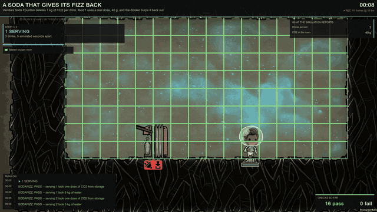](https://github.com/Salacious-Oni-Dev/oni-flagship-mods/releases/download/v0.1.0-alpha.1/sodafizz.mp4) | **Soda fizz**<br>Vanilla's Soda Fountain deletes 1 kg of CO2 per drink. With Mod 1 each drink holds a real 40 g of CO2, and the drinker burps it back into the room, where it is weighed. |
| [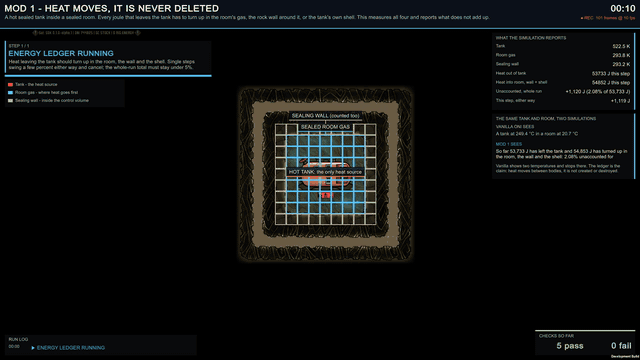](https://github.com/Salacious-Oni-Dev/oni-flagship-mods/releases/download/v0.1.0-alpha.1/energy.mp4) | **Heat is never deleted**<br>A hot sealed tank inside a sealed room. Every joule that leaves the tank has to turn up in the room's gas, the rock wall or the tank's own shell. The run measures all of them and reports anything that does not add up; the numbers are in the side panel. |
| [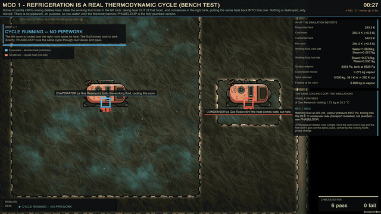](https://github.com/Salacious-Oni-Dev/oni-flagship-mods/releases/download/v0.1.0-alpha.1/fridge.mp4) | **Refrigeration cycle**<br>Some vanilla cooling deletes heat. Here a working fluid boils in the left tank, cooling that room, and condenses in the right tank, warming that room by the same amount. There is no pipework, so only the thermodynamics is on show. |
| [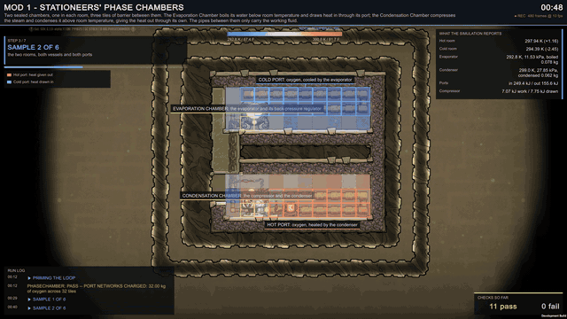](https://github.com/Salacious-Oni-Dev/oni-flagship-mods/releases/download/v0.1.0-alpha.1/phasechamber.mp4) | **Phase chambers**<br>Two sealed chambers modelled on Stationeers' phase chambers. The Evaporation Chamber boils its water below room temperature and draws heat in; the Condensation Chamber compresses the steam and condenses it above room temperature, giving that heat out. The pipes between them carry only the working fluid. |
| [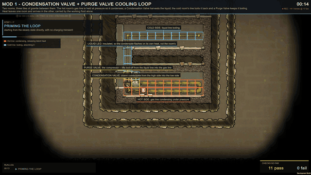](https://github.com/Salacious-Oni-Dev/oni-flagship-mods/releases/download/v0.1.0-alpha.1/phaseloop.mp4) | **Condensation cooling loop**<br>The plumbed version of the refrigeration cycle. In the hot room the gas line is held at pressure and condenses; a Condensation Valve drains the liquid into the cold room's line, where it boils back and a Purge Valve keeps it boiling. The two rooms' temperatures move apart, and only the working fluid crosses between them. |
| [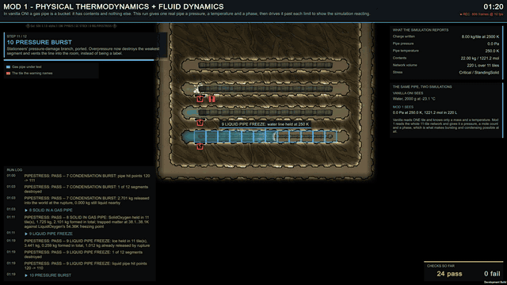](https://github.com/Salacious-Oni-Dev/oni-flagship-mods/releases/download/v0.1.0-alpha.1/pipestress.mp4) | **Pipe stress**<br>A vanilla gas pipe holds a mass and a temperature, and nothing else. Mod 1 gives a pipe network a volume, a pressure and a phase, then pushes one line past each limit: oxygen condensing and freezing solid inside the pipe, a water line freezing to ice, and an overpressure burst that vents the line into the room. |

## Requirements

Both mods need the SDK's replacement `SimDLL.dll` and the `OniFramework` mod, from the same SDK
release. See the SDK guide
[Installing and removing](https://github.com/Salacious-Oni-Dev/oni-sdk-docs/blob/main/guides/installing.md).

## Building

Requirements:
- the .NET SDK, version 6 or later
- bash
- an installed copy of the game
- a checkout of `oni-framework-api` beside this one, built once with its own `build.sh`

```
parent/
  oni-framework-api/
  oni-flagship-mods/
```

```sh
export ONI_GAME=/path/to/OxygenNotIncluded
(cd ../oni-framework-api && ./build.sh)
./build.sh                      # both mods
./build.sh mod1-thermo-fluid    # one mod
```

Each mod's output is its `bin/Release/` folder: the mod's DLL, `mod.yaml` and `mod_info.yaml`.
It does not contain `OniFramework.dll`, and must not: the framework is installed once, as its
own mod.

### Building on Windows

`build.ps1` does what `build.sh` does, in Windows PowerShell, without WSL or bash.

#### Tools

```powershell
winget install Microsoft.DotNet.SDK.8
winget install Git.Git                            # optional
```

Open a new PowerShell window afterwards. Windows does not run PowerShell scripts by default: run
`Set-ExecutionPolicy -Scope CurrentUser RemoteSigned` once, or use
`powershell -ExecutionPolicy Bypass -File` as below.

#### Build

The mods build against `oni-framework-api`, cloned beside this repository and built first (see
its README; it bundles `oni-sim-replacement`, so clone that too):

```powershell
git clone https://github.com/Salacious-Oni-Dev/oni-sim-replacement.git
git clone https://github.com/Salacious-Oni-Dev/oni-framework-api.git
git clone https://github.com/Salacious-Oni-Dev/oni-flagship-mods.git
$env:ONI_GAME = "C:\Program Files (x86)\Steam\steamapps\common\OxygenNotIncluded"
powershell -ExecutionPolicy Bypass -File oni-sim-replacement\sim\build.ps1
powershell -ExecutionPolicy Bypass -File oni-framework-api\build.ps1
powershell -ExecutionPolicy Bypass -File oni-flagship-mods\build.ps1
```

To build one mod, name its folder: `... -File oni-flagship-mods\build.ps1 mod1-thermo-fluid`.
`ONI_GAME` (or `-OniGame "<folder>"`) is the folder that contains `OxygenNotIncluded_Data`.

## Installing

Copy each mod's folder into the game's local mods folder. From a
[release](https://github.com/Salacious-Oni-Dev/oni-flagship-mods/releases), unpack `oni-flagship-mods-<version>.zip` and
copy `mod1-thermo-fluid` and `mod2-matter-environment`. From a build, copy each mod's
`bin/Release/` contents into a folder of that name, for example
`Documents/Klei/OxygenNotIncluded/mods/Local/mod1-thermo-fluid/`. Enable the mods in the game's
Mods screen. `OniFramework` must be listed above both mods. If it is
below them, it moves itself up and restarts the game once, with a message before and after.

## License

MIT, see `LICENSE`.

## Credits

Oxygen Not Included is developed and published by Klei Entertainment. This project is not
affiliated with or endorsed by Klei.

Development of this project uses AI coding assistants. All changes are reviewed and released
by the maintainer.
